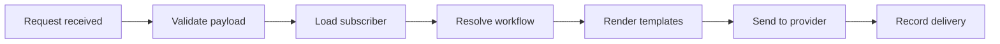

Every trigger goes through the same seven stages. Each stage writes an entry to the execution log, so the first stage without a success entry tells you where a notification stopped.

Bad input stops at validation. A missing subscriber stops at load. An opt-out stops at workflow resolution. A template bug stops at render.
