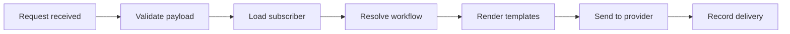
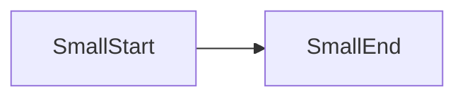
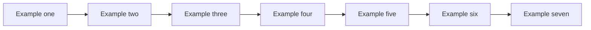

ALPHA paragraph. A notification starts when the API receives a trigger request with a workflow id, a subscriber id and a payload. The pipeline validates the payload, loads the subscriber and resolves which steps run.



BRAVO paragraph. Each channel step renders its templates with the payload and subscriber data, hands the result to a provider, and records the outcome so you can trace a missing notification back to the stage where it stopped.



- LIST item with a nested wide diagram that Pi leaves as source:

  ```mermaid
  flowchart LR
    N1[Nested one] --> N2[Nested two] --> N3[Nested three] --> N4[Nested four] --> N5[Nested five] --> N6[Nested six] --> N7[Nested seven]
  ```

````markdown

````

CHARLIE paragraph. This closing paragraph comes after every diagram and example block, and it must wrap back inside the centered column exactly like the ALPHA and BRAVO paragraphs above it.
